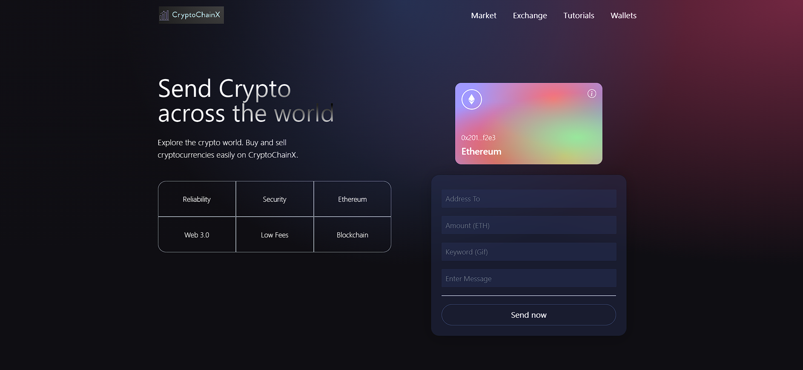
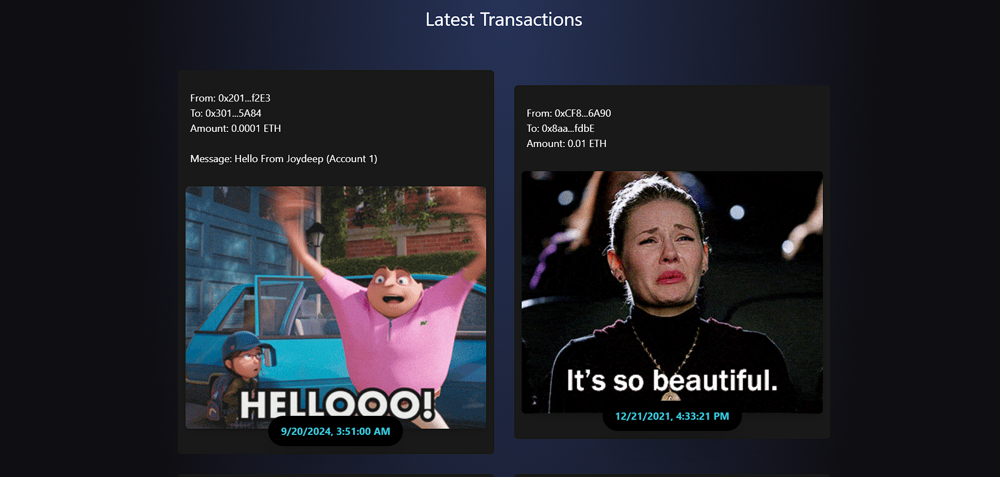

# CryptoChainX 🌐💰


## Overview

**CryptoChainX** is a cutting-edge Web 3.0 blockchain application built with **React**, **Solidity**, and **Ethereum**. This project showcases the potential of decentralized applications (dApps) by providing a secure platform for cryptocurrency transactions.

### Project Name Meaning

The name **CryptoChainX** reflects the project's core focus on:
- **Cryptocurrency Transactions** (Crypto)
- **Blockchain Technology** (Chain)
- **Exchange or dApp Functionality** (X for exchange or app integration)

It sounds modern and aligns well with the decentralized nature of your Web 3.0 and blockchain-based application.

## Key Features 🚀

- **Smart Contract Integration**:  
  Written in **Solidity** and deployed on the Ethereum blockchain, enabling automated and secure transactions.

- **Ethereum Wallet Support**:  
  Seamlessly connect wallets like **MetaMask** to send and receive cryptocurrency with ease.

- **Decentralized Application (dApp)**:  
  Engage in secure and trustless transactions directly on the Ethereum blockchain.

- **Responsive UI**:  
  A modern, user-friendly interface built with **React** that provides an intuitive experience on any device.
# To run go to client and run  
```bash
npm run dev
```
## Installation 🔧

To get started with CryptoChainX, follow these steps:

1. Clone the repository:
   ```bash
   git clone https://github.com/VoldsenJoy-git/CryptoChainX.git
